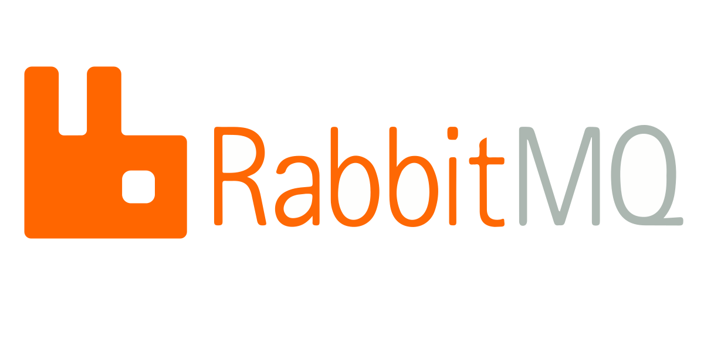
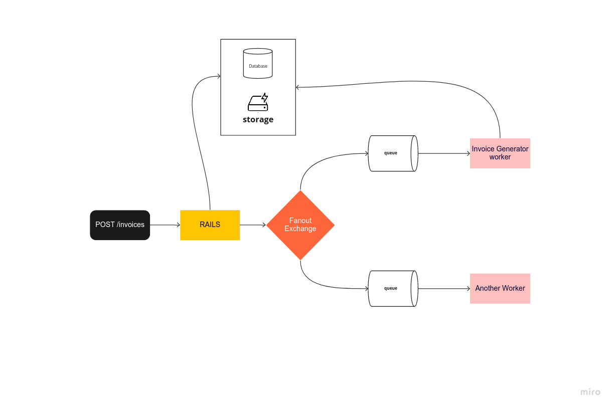

<p align="center">
  

  <h3 align="center">Rabbitmq with Rails</h3>

  <p align="center">
   simple demo app
  </p>
</p>

## About The Project

simple demo app to use rabbitmq with rails framework.
in this app i used fanout exchange with two queues bounded to this exchange.
when a message created from rails api, message published to fanout exchange then directed to the two queues.
each worker consume from its queue, one for generating pdf invoice and the other is just a dummy logger 🙄

## Diagram

<p align="center">
  
</p>

## Usage

1. Clone the repo

   ```sh
   git clone https://github.com/civilcoder55/demo-rabbitmq-with-rails.git
   ```

2. run containers

   ```sh
   docker-compose up -d
   ```

3. create invoice

    ```sh
    curl --request POST \
        --url http://127.0.0.1:3000/invoices \
        --header 'Content-Type: application/json' \
        --data '{
            "invoice": {
                "number": 123,
                "date": "2023-03-10T23:34:48.224Z",
                "payment_method": "paypal",
                "footer": "Thanks",
                "company": {
                    "name": "civilcoder55",
                    "address": "egypt",
                    "email": "temp.dev.56@gmail.com"
                },
                "recipient": {
                    "name": "customer",
                    "address1": "egypt",
                    "address2": "giza 333333",
                    "email": "customer@test.com"
                },
                "lines": [
                    {
                        "name": "ruby development",
                        "price": 30,
                        "quantity": 30
                    }
                ]
            }
            }'
    ```
4. ping the invoice for download url

    ```sh
    curl --request GET --url http://127.0.0.1:3000/invoices/1
    ```

## gems
- [Bunny](https://github.com/ruby-amqp/bunny): rabbitmq client
- [Sneakers](https://github.com/jondot/sneakers): backgroud worker
- [Receipts](https://github.com/excid3/receipts): generating pdf invoices